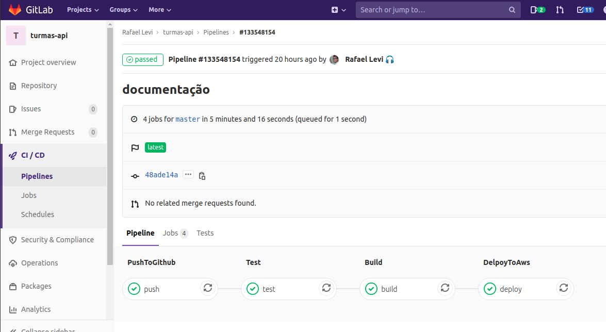
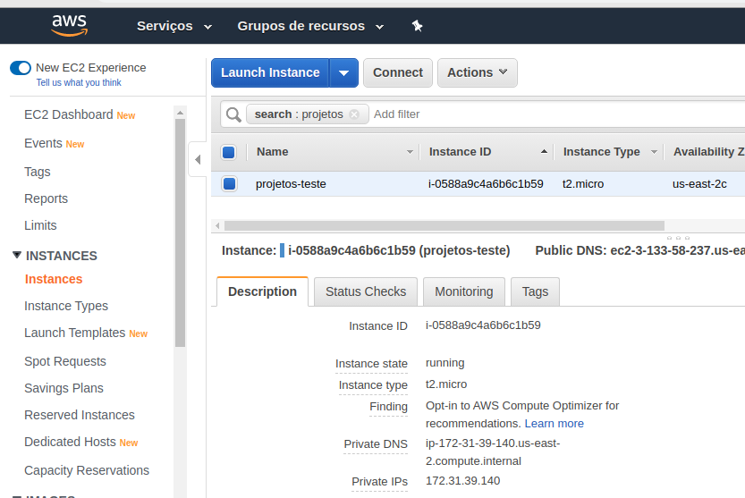
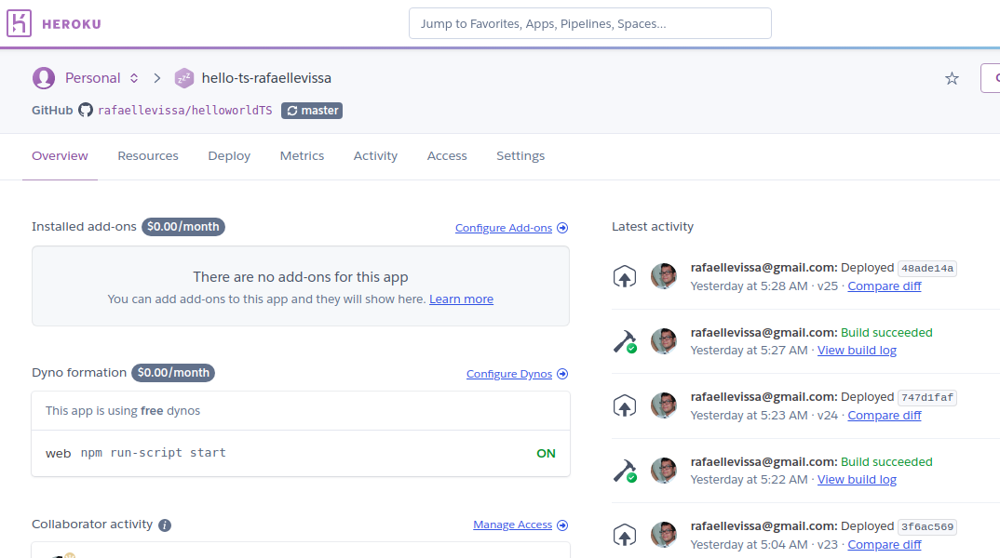
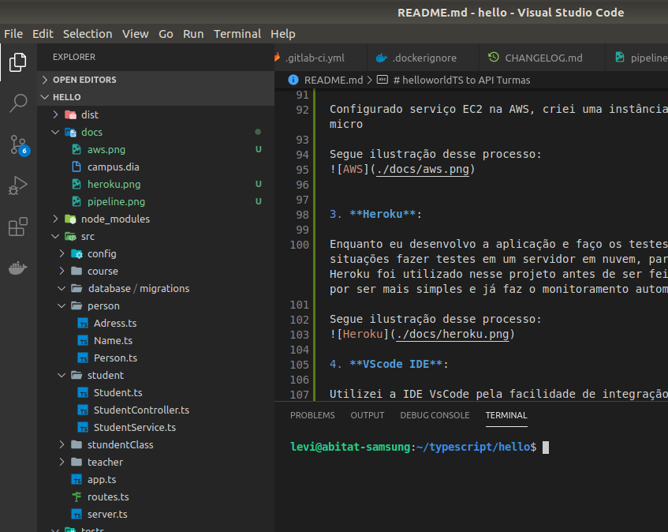

# helloworldTS to API Turmas

**Objetivo**: 
Projeto de Back-end com TS (API Rest). Hello world com TypeScript, do básico ao avançado, usando frameworks e lançando as versões em escala de dificuldade. Vou implementar os recursos e avançando com o projeto de Hello World até chegar a uma API. Pretendo implementar **Deploy Contínuo** e containerizar a aplicação do **Docker**, além de utilizar os princípios de **TDD** e **DDD**.

**Justificativa:** 
Resolvi fazer o projeto com a melhor qualidade de software que consigo. Reuni tecnologias e metodologias como: JS, TS, Node JS, Git, GitLab CI, OO (Orientação à Objetos de verdade!), SOLID, documentação UML, DDD, TDD, testes automatizados, Devops com Docker, docker-compose, AWS, Heroku, inclui Licença de uso de software, ChangeLog, Contributing open source, API Rest. Usei frameworks e pacotes: Babel, Express, npm, Eslint, Jest, Cross-env, nodemon, sucrase. Para mim é importante reunir esses conceitos de base da tecnologia junto à novas tecnologias emergentes para consolidar o que há de melhor do meio acadêmico à tecnologia de ponta na prática, encaro como um desafio pessoal. Com ajuda do grande Adarlan Teixeira muito obrigado por me ajudar a construir o melhor projeto de Dev da minha vida. 

**Referências:**
Usei como referência para boas práticas o 
- the-twelve-factor-app do James Lindenbaum et al. (Heroku)
- Domain-Driven Design do Eric Evans
- ChangeLog do Olivier Lacan
- o Clean Code e SOLID do Robert Cecil Martin 
- Test Driven Development e Manifesto Ágil do Kent Beck et al. 
- Devops do Patrick Debois et al. 
- e mais referências que não consegui citar. 

obs.: Não utilizei todos os princípios por completo.

**Planejamento de estudo:**

O que pretendo entender e construir no projeto

[Node JS](https://nodejs.org/en/)

[Express - Framework web para Node JS](https://expressjs.com/)

[Typescript](https://www.typescriptlang.org/index.html)

[npm: Gerenciador de dependências](https://www.npmjs.com/)

[Sequelize - ORM ](https://sequelize.org/) ou [Query Builder Knex](http://knexjs.org/)

[Adonis Framework](https://preview.adonisjs.com/guides/http/introduction)

[Mongoose: Modelador de objetos de MongoDB para node JS](https://mongoosejs.com/)

[Deno: runtime para TS](https://deno.land/)

* Ferramentas:

[Prettier - Formatador de códigos opinativo](https://prettier.io/)

[Eslint - Analise de padrão de código](https://eslint.org/)

[Nodemon - Reiniciar automaticamente a aplicação](https://www.npmjs.com/package/nodemon)

[Sucrase - development build](https://www.npmjs.com/package/sucrase)

[Cors - Middleware](https://www.npmjs.com/package/cors)

[Jest: Testes](https://jestjs.io/)

[cross-env - Acesso ao banco para testes](https://www.npmjs.com/package/cross-env)

[Supertest - requisição a APIs para teste](https://www.npmjs.com/package/supertest)

[Celebrate - Validações](https://www.npmjs.com/package/celebrate)

[Cross-env - Variáveis de ambiente](https://www.npmjs.com/package/cross-env)

* extra:

[Documentação do JS](https://devdocs.io/javascript/)

* [ChangeLog](https://keepachangelog.com/pt-BR/1.0.0/)

* [12factor](https://12factor.net/pt_br/)

* Heroku:

View [app](https://hello-ts-rafaellevissa.herokuapp.com/) in Heroku

**Implementações:**

1. **Deploy Contínuo**: Fiz configurações de deploy contínuo através do arquivo .gitlab-cy.yml, configurei os jobs: 

  - pushToGithub
  - test
  - build
  - delpoyToAws

Quando eu subo o código para o repositório do GitLab, rodo um pipeline automático para subir uma cópia do projeto para o Github (pushToGithub). Tomei a decisão de usar o sistema de automação de deploy do gitlab por conta da minha experiência apenas com o Gitlab, preciso aprender GitHub Actions.

O segundo job é o de testes, que executa as classes de teste do projeto em ambiente simplificado.

Após os testes, partimos para fazer o processo de build do projeto, que basicamente consiste em instalar as dependências e transpilar o código TypeScript para JavaScript.

Finalmente após esse job, ao final do pipeline temos o deploy no servidor da AWS. Antes desse processo eu configurei uma VM sob serviço EC2 de forma padrão.

Segue ilustração desse processo:

2. **Configuração de nuvem**:

Configurado serviço EC2 na AWS, criei uma instância com linux Ubuntu em uma máquina t2.micro

Segue ilustração desse processo:

3. **Heroku**:

Enquanto eu desenvolvo a aplicação e faço os testes em localhost, é necessário em algumas situações fazer testes em um servidor em nuvem, para isso o que prefiro é o Heroku. O Heroku foi utilizado nesse projeto antes de ser feita a configuração do servidor da AWS, por ser mais simples e já faz o monitoramento automático do repositório do Github.

Segue ilustração desse processo:

4. **VScode IDE**:

Utilizei a IDE VsCode pela facilidade de integração com Git, facilidades de estilização, configuração personalizada e facilidade de manipulação para operacionalização do sistema.

Segue ilustração desse processo:

5. **ORM**:

Tentei utilizar logo de cara o Sequelize com TypeScript mas tive dificuldades com a pobre documentação. Alguns devs me recomendaram o Adonis, que em sua versão 5 já tem suporte nativo a TS, será minha segunda tentativa. Fiz a implementação do AdonisV5, mas ainda tem muita coisa em construção então resolvi trabalhar com ele em um projeto separado para testar apenas. Vou partir para o TypeORM, durante o processo percebi que vou precisar do NestJS junto com o TypeORM